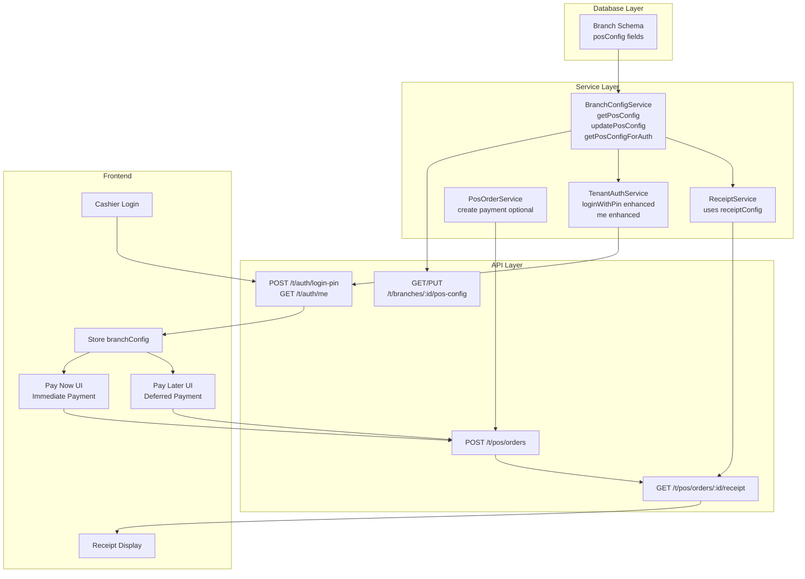
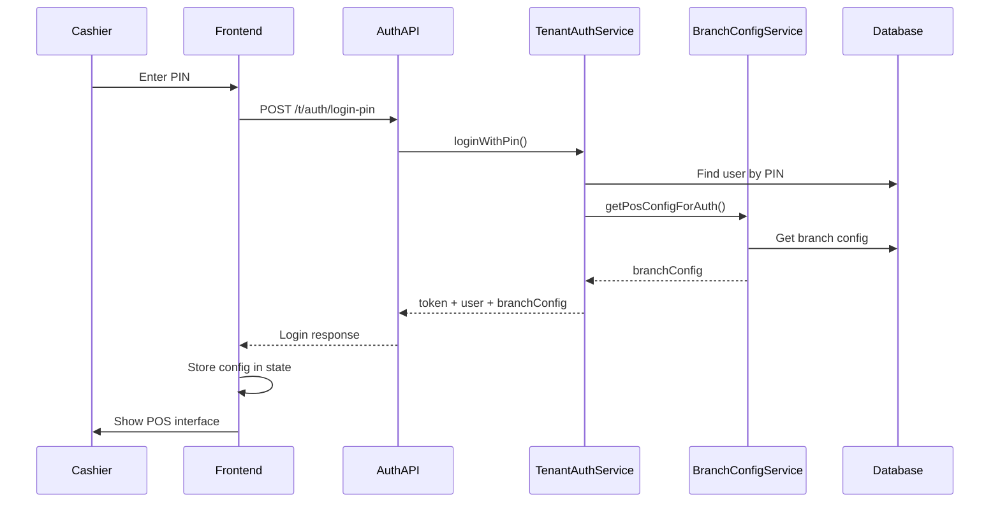
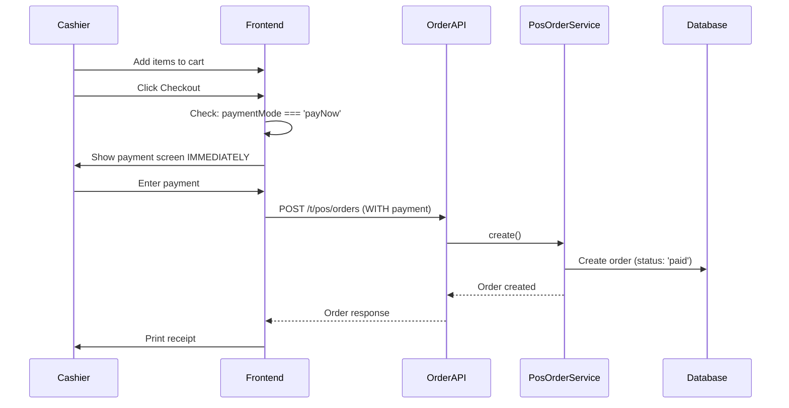
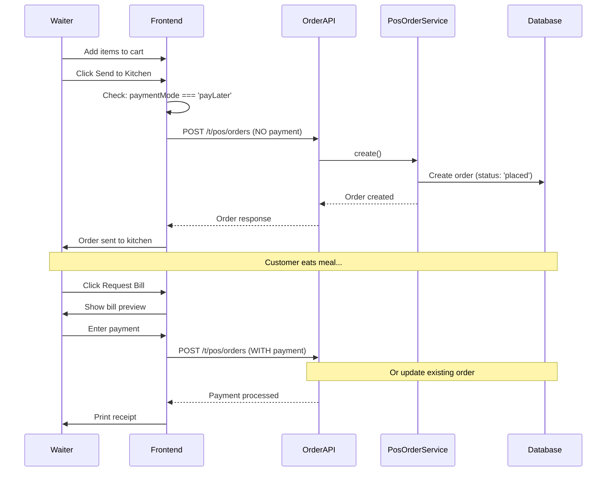
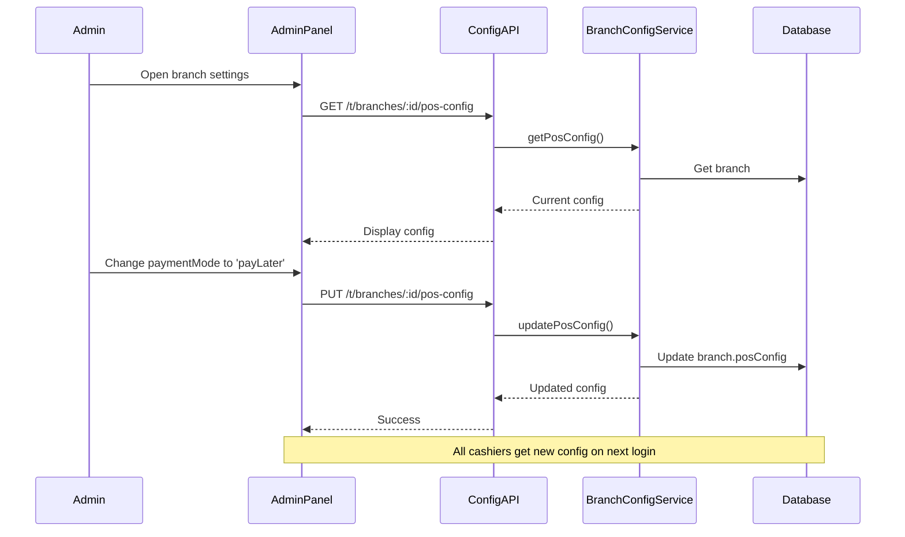

# Branch POS Configuration - Architecture

## System Architecture



---

## Data Flow

### 1. Cashier Login Flow



---

### 2. Pay Now Flow (KFC Style)



---

### 3. Pay Later Flow (Fine Dining Style)



---

### 4. Config Update Flow



---

## Database Schema

### Branch Collection

```javascript
{
  _id: ObjectId,
  name: "Main Branch",
  code: "MAIN01",
  currency: "PKR",
  timezone: "Asia/Karachi",
  
  tax: {
    mode: "exclusive",
    rate: 15,
    vatNumber: "VAT123"
  },
  
  posConfig: {
    // Existing fields
    orderPrefix: "ORD",
    receiptFooter: "Thank you!",
    enableHoldOrders: true,
    enableTableService: false,
    
    // NEW: Payment workflow mode
    paymentMode: "payNow", // or "payLater"
    
    // NEW: Receipt customization
    receiptConfig: {
      showLogo: false,
      logoUrl: "",
      showQRCode: false,
      qrCodeData: "",
      headerText: "",
      footerText: "Thank you for your business!",
      showTaxBreakdown: true,
      showItemCodes: false,
      paperWidth: 80,
      fontSizeMultiplier: 1.0
    },
    
    // NEW: Payment method settings
    paymentMethods: {
      cash: {
        enabled: true,
        taxRateOverride: null
      },
      card: {
        enabled: true,
        taxRateOverride: null,
        minAmount: 0
      },
      mobile: {
        enabled: true,
        taxRateOverride: null
      }
    }
  }
}
```

---

## API Endpoints

### Branch Configuration

| Endpoint | Method | Purpose | Returns |
|----------|--------|---------|---------|
| `/t/branches/:id/pos-config` | GET | Get POS config | Full config |
| `/t/branches/:id/pos-config` | PUT | Update config | Updated config |

### Authentication (Enhanced)

| Endpoint | Method | Enhancement | Returns |
|----------|--------|-------------|---------|
| `/t/auth/login-pin` | POST | Includes `branchConfig` | token + user + **branchConfig** |
| `/t/auth/me` | GET | Includes `branchConfig` | user + **branchConfig** |

### Orders (Enhanced)

| Endpoint | Method | Enhancement | Behavior |
|----------|--------|-------------|----------|
| `/t/pos/orders` | POST | Payment optional | Creates order with/without payment |

### Receipts (Enhanced)

| Endpoint | Method | Enhancement | Behavior |
|----------|--------|-------------|----------|
| `/t/pos/orders/:id/receipt` | GET | Uses `receiptConfig` | Customized receipt |

---

## Service Methods

### BranchConfigService

```javascript
class BranchConfigService {
  // Get full POS config (for admin panel)
  static async getPosConfig(conn, branchId)
  
  // Update POS config (for admin panel)
  static async updatePosConfig(conn, branchId, configData)
  
  // Get lightweight config (for auth responses)
  static async getPosConfigForAuth(conn, branchId)
}
```

### TenantAuthService (Enhanced)

```javascript
class TenantAuthService {
  // Enhanced to include branchConfig
  static async loginWithPin(_conn, { pin, terminalId })
  
  // Enhanced to include branchConfig
  static async me(conn, { uid })
}
```

### PosOrderService (Enhanced)

```javascript
class PosOrderService {
  // Enhanced to support optional payment
  static async create(conn, tenantSlug, userContext, payload)
  // Now accepts orders with or without payment data
  // Uses branch.posConfig.paymentMethods for tax overrides
}
```

### ReceiptService (Enhanced)

```javascript
class ReceiptService {
  // Enhanced to use receiptConfig
  static async generateReceipt(conn, orderId, format)
  // Now includes logo, QR codes, custom text, etc.
}
```

---

## Configuration Validation

### Joi Schema

```javascript
const updatePosConfig = Joi.object({
  orderPrefix: Joi.string().max(10).optional(),
  receiptFooter: Joi.string().max(500).optional(),
  enableHoldOrders: Joi.boolean().optional(),
  enableTableService: Joi.boolean().optional(),
  paymentMode: Joi.string().valid('payNow', 'payLater').optional(),
  
  receiptConfig: Joi.object({
    showLogo: Joi.boolean().optional(),
    logoUrl: Joi.string().uri().allow('').optional(),
    showQRCode: Joi.boolean().optional(),
    qrCodeData: Joi.string().max(500).allow('').optional(),
    headerText: Joi.string().max(200).allow('').optional(),
    footerText: Joi.string().max(500).allow('').optional(),
    showTaxBreakdown: Joi.boolean().optional(),
    showItemCodes: Joi.boolean().optional(),
    paperWidth: Joi.number().valid(58, 80).optional(),
    fontSizeMultiplier: Joi.number().min(0.5).max(2.0).optional()
  }).optional(),
  
  paymentMethods: Joi.object({
    cash: Joi.object({
      enabled: Joi.boolean().optional(),
      taxRateOverride: Joi.number().min(0).max(99.99).allow(null).optional()
    }).optional(),
    card: Joi.object({
      enabled: Joi.boolean().optional(),
      taxRateOverride: Joi.number().min(0).max(99.99).allow(null).optional(),
      minAmount: Joi.number().min(0).optional()
    }).optional(),
    mobile: Joi.object({
      enabled: Joi.boolean().optional(),
      taxRateOverride: Joi.number().min(0).max(99.99).allow(null).optional()
    }).optional()
  }).optional()
});
```

---

## Security & Permissions

### Required Permissions

| Action | Permission |
|--------|-----------|
| View POS config | `branches.read` |
| Update POS config | `branches.manage` OR `branches.settings` |

### Branch-Scoped Access

- Cashiers can only access config for their assigned branch
- Admins with tenant scope can access all branches
- Config is automatically filtered by branch assignment

---

## Performance Considerations

1. **Config is cached in JWT** - No extra DB calls during order creation
2. **Lightweight auth response** - Only essential config fields returned
3. **No breaking changes** - All new fields have defaults
4. **Backward compatible** - Existing orders work without changes

---

## Testing Strategy

### Unit Tests

- ✅ BranchConfigService methods
- ✅ Validation schemas
- ✅ Auth service enhancements

### Integration Tests

- ✅ Login returns branchConfig
- ✅ ME API returns branchConfig
- ✅ Orders work with/without payment
- ✅ Receipts use receiptConfig

### E2E Tests

- ✅ Pay Now flow (full cycle)
- ✅ Pay Later flow (full cycle)
- ✅ Config update propagation

---

## Deployment Checklist

- [x] Database schema updated (backward compatible)
- [x] New service methods created
- [x] API endpoints added
- [x] Validation schemas added
- [x] Auth responses enhanced
- [x] Order service updated
- [x] Receipt service updated
- [x] Documentation created
- [x] No linting errors
- [ ] Frontend integration (pending)
- [ ] Admin panel UI (pending)

---

## Future Enhancements

1. **Table Management** - Track table numbers for payLater mode
2. **Split Bills** - Allow multiple payments per order
3. **Order Modification** - Edit orders before payment in payLater mode
4. **Kitchen Display** - Separate kitchen receipt format
5. **Multi-Receipt** - Kitchen order + Bill preview + Final receipt
6. **Analytics** - Track payment mode performance

---

**Status:** ✅ Backend implementation complete and ready for frontend integration!

