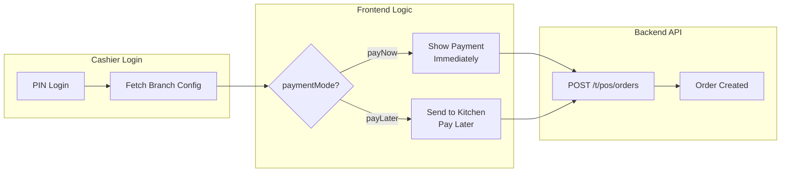

# Branch POS Configuration Guide

## Overview

The Branch POS Configuration module allows you to control POS behavior and receipt customization at the branch level. This is primarily a **frontend-driven feature** where the backend provides configuration settings that the frontend uses to determine UI/UX behavior.

---

## 🎯 Key Concepts

### Payment Modes

| Mode | Description | Use Case | Frontend Behavior |
|------|-------------|----------|-------------------|
| **payNow** | Immediate payment required | Fast food, KFC, McDonald's style | Show payment screen immediately after adding items |
| **payLater** | Deferred payment (bill after service) | Fine dining, restaurants | Send order to kitchen → Serve → Request bill → Payment |

### How It Works



---

## 📡 API Endpoints

### 1. Get Branch POS Configuration

**Endpoint:** `GET /t/branches/{branchId}/pos-config`

**Purpose:** Retrieve POS behavior settings and receipt customization for a branch.

**Response:**
```json
{
  "status": 200,
  "message": "POS configuration retrieved successfully",
  "result": {
    "branchId": "695c0a424a21fc8972afb942",
    "branchName": "Main Branch",
    "currency": "PKR",
    "timezone": "Asia/Karachi",
    "tax": {
      "mode": "exclusive",
      "rate": 15,
      "vatNumber": "VAT123456"
    },
    "posConfig": {
      "orderPrefix": "ORD",
      "receiptFooter": "Thank you!",
      "enableHoldOrders": true,
      "enableTableService": false,
      "paymentMode": "payNow",
      "receiptConfig": {
        "showLogo": true,
        "logoUrl": "https://example.com/logo.png",
        "showQRCode": false,
        "qrCodeData": "",
        "headerText": "Welcome to Our Restaurant",
        "footerText": "Visit us again!",
        "showTaxBreakdown": true,
        "showItemCodes": false,
        "paperWidth": 80,
        "fontSizeMultiplier": 1.0
      },
      "paymentMethods": {
        "cash": {
          "enabled": true,
          "taxRateOverride": 5
        },
        "card": {
          "enabled": true,
          "taxRateOverride": 16,
          "minAmount": 0
        },
        "mobile": {
          "enabled": true,
          "taxRateOverride": null
        }
      }
    }
  }
}
```

---

### 2. Update Branch POS Configuration

**Endpoint:** `PUT /t/branches/{branchId}/pos-config`

**Purpose:** Update POS behavior settings. Changes take effect immediately for all cashiers.

**Request Body:**
```json
{
  "paymentMode": "payLater",
  "enableTableService": true,
  "receiptConfig": {
    "showLogo": true,
    "logoUrl": "https://example.com/logo.png",
    "footerText": "Visit us again!",
    "showTaxBreakdown": true,
    "paperWidth": 80
  },
  "paymentMethods": {
    "cash": {
      "enabled": true,
      "taxRateOverride": 5
    },
    "card": {
      "enabled": true,
      "taxRateOverride": 16
    }
  }
}
```

**Response:**
```json
{
  "status": 200,
  "message": "POS configuration updated successfully",
  "result": { /* same as GET response */ }
}
```

---

### 3. Cashier Login (Enhanced)

**Endpoint:** `POST /t/auth/login-pin`

**Purpose:** Cashier logs in with PIN and receives branch config automatically.

**Request:**
```json
{
  "pin": "123456",
  "terminalId": "terminal_123"
}
```

**Response (Enhanced with branchConfig):**
```json
{
  "status": 200,
  "message": "Login successful",
  "result": {
    "token": "eyJhbGciOiJIUzI1NiIsInR5cCI6IkpXVCJ9...",
    "user": { /* user details */ },
    "branchId": "695c0a424a21fc8972afb942",
    "posId": "695c0a424a21fc8972afb943",
    "branchConfig": {
      "branchId": "695c0a424a21fc8972afb942",
      "branchName": "Main Branch",
      "currency": "PKR",
      "paymentMode": "payNow",
      "enableTableService": false,
      "receiptConfig": {
        "showLogo": false,
        "logoUrl": "",
        "footerText": "Thank you for your business!"
      },
      "paymentMethods": {
        "cash": { "enabled": true },
        "card": { "enabled": true },
        "mobile": { "enabled": true }
      }
    }
  }
}
```

---

### 4. Get Current User (ME API - Enhanced)

**Endpoint:** `GET /t/auth/me`

**Purpose:** Get current user info with branch config included.

**Response:**
```json
{
  "status": 200,
  "message": "OK",
  "result": {
    "uid": "695c19f328e0595f4d5992c1",
    "fullName": "John Cashier",
    "email": "cashier@example.com",
    "roles": ["cashier"],
    "assignedBranchId": "695c0a424a21fc8972afb942",
    "branchConfig": {
      "branchId": "695c0a424a21fc8972afb942",
      "branchName": "Main Branch",
      "currency": "PKR",
      "paymentMode": "payNow",
      /* ... rest of config ... */
    }
  }
}
```

---

## 🖥️ Frontend Integration

### Step 1: Login and Get Config

```javascript
// Cashier logs in with PIN
const loginResponse = await fetch('/t/auth/login-pin', {
  method: 'POST',
  headers: { 'Content-Type': 'application/json' },
  body: JSON.stringify({
    pin: '123456',
    terminalId: 'terminal_123'
  })
});

const { result } = await loginResponse.json();
const { token, branchConfig } = result;

// Store config in state/context
localStorage.setItem('token', token);
localStorage.setItem('branchConfig', JSON.stringify(branchConfig));
```

---

### Step 2: Conditional UI Based on Payment Mode

```javascript
const branchConfig = JSON.parse(localStorage.getItem('branchConfig'));

if (branchConfig.paymentMode === 'payNow') {
  // KFC Mode: Show payment screen immediately
  function handleCheckout(cart) {
    // Show payment modal immediately
    showPaymentModal(cart);
  }
  
  async function submitOrder(cart, payment) {
    // Submit order WITH payment data
    const response = await fetch('/t/pos/orders', {
      method: 'POST',
      headers: {
        'Authorization': `Bearer ${token}`,
        'x-tenant-id': tenantId,
        'Content-Type': 'application/json'
      },
      body: JSON.stringify({
        branchId: branchConfig.branchId,
        items: cart.items,
        paymentMethod: payment.method,
        amountPaid: payment.amount,
        customerName: cart.customerName
      })
    });
    
    const order = await response.json();
    printReceipt(order.result.id);
  }
}

if (branchConfig.paymentMode === 'payLater') {
  // Fine Dining Mode: Send to kitchen first, pay later
  async function sendToKitchen(cart) {
    // Submit order WITHOUT payment data
    const response = await fetch('/t/pos/orders', {
      method: 'POST',
      headers: {
        'Authorization': `Bearer ${token}`,
        'x-tenant-id': tenantId,
        'Content-Type': 'application/json'
      },
      body: JSON.stringify({
        branchId: branchConfig.branchId,
        items: cart.items,
        customerName: cart.customerName,
        // NO payment data
      })
    });
    
    const order = await response.json();
    // Order is created with status='placed' (unpaid)
    return order.result;
  }
  
  async function requestBillAndPay(orderId, payment) {
    // Later, when customer requests bill, process payment
    // Option 1: Update the existing order (if you implement payment endpoint)
    // Option 2: Just create a new order with payment (current approach)
    
    // For now, you can just show the bill and then mark as paid
    // The backend already supports orders without payment
  }
}
```

---

### Step 3: Receipt Customization

```javascript
// Use receipt config when generating receipts
const receiptConfig = branchConfig.receiptConfig;

function generateReceipt(order) {
  return `
    ${receiptConfig.showLogo ? `` : ''}
    ${receiptConfig.headerText ? `<h2>${receiptConfig.headerText}</h2>` : ''}
    
    <div class="order-details">
      <p>Order: ${order.orderNumber}</p>
      <p>Date: ${order.date}</p>
    </div>
    
    <div class="items">
      ${order.items.map(item => `
        <div class="item">
          ${receiptConfig.showItemCodes ? `<span>${item.code}</span>` : ''}
          <span>${item.name}</span>
          <span>${item.quantity} x ${item.price}</span>
        </div>
      `).join('')}
    </div>
    
    ${receiptConfig.showTaxBreakdown ? `
      <div class="tax-breakdown">
        <p>Subtotal: ${order.subtotal}</p>
        <p>Tax (${order.taxRate}%): ${order.tax}</p>
      </div>
    ` : ''}
    
    <div class="total">
      <strong>Total: ${order.total} ${branchConfig.currency}</strong>
    </div>
    
    ${receiptConfig.showQRCode ? `` : ''}
    
    <p class="footer">${receiptConfig.footerText}</p>
  `;
}
```

---

## 🔧 Configuration Options

### Payment Mode Options

| Option | Default | Description |
|--------|---------|-------------|
| `payNow` | ✅ | Immediate payment (fast food style) |
| `payLater` | | Deferred payment (fine dining style) |

### Receipt Config Options

| Field | Type | Default | Description |
|-------|------|---------|-------------|
| `showLogo` | Boolean | `false` | Display logo on receipt |
| `logoUrl` | String | `""` | URL of logo image |
| `showQRCode` | Boolean | `false` | Display QR code on receipt |
| `qrCodeData` | String | `""` | QR code data (URL/payment link) |
| `headerText` | String | `""` | Custom header text |
| `footerText` | String | `"Thank you!"` | Custom footer text |
| `showTaxBreakdown` | Boolean | `true` | Show tax calculation details |
| `showItemCodes` | Boolean | `false` | Show item codes on receipt |
| `paperWidth` | Number | `80` | Thermal paper width (58 or 80mm) |
| `fontSizeMultiplier` | Number | `1.0` | Font size multiplier (0.5-2.0) |

### Payment Method Options

| Method | Fields | Description |
|--------|--------|-------------|
| `cash` | `enabled`, `taxRateOverride` | Cash payment settings |
| `card` | `enabled`, `taxRateOverride`, `minAmount` | Card payment settings |
| `mobile` | `enabled`, `taxRateOverride` | Mobile payment settings |

**Tax Rate Override:** If set, overrides branch-level tax rate for this payment method.

---

## 🔐 Permissions

| Action | Required Permission |
|--------|---------------------|
| View POS config | `branches.read` |
| Update POS config | `branches.manage` or `branches.settings` |

---

## 📝 Example Use Cases

### Use Case 1: Fast Food Restaurant (Pay Now)

```json
{
  "paymentMode": "payNow",
  "enableTableService": false,
  "receiptConfig": {
    "showLogo": true,
    "logoUrl": "https://example.com/logo.png",
    "footerText": "Thank you! Visit us again!",
    "showTaxBreakdown": true,
    "paperWidth": 80
  }
}
```

**Frontend Flow:**
1. Cashier adds items to cart
2. Click "Checkout" → Payment screen appears immediately
3. Process payment → Order created with `status: 'paid'`
4. Print receipt

---

### Use Case 2: Fine Dining Restaurant (Pay Later)

```json
{
  "paymentMode": "payLater",
  "enableTableService": true,
  "receiptConfig": {
    "showLogo": true,
    "logoUrl": "https://example.com/restaurant-logo.png",
    "headerText": "Fine Dining Experience",
    "footerText": "We hope you enjoyed your meal!",
    "showTaxBreakdown": true,
    "showQRCode": true,
    "qrCodeData": "https://restaurant.com/feedback",
    "paperWidth": 80
  }
}
```

**Frontend Flow:**
1. Waiter takes order on tablet
2. Click "Send to Kitchen" → Order created with `status: 'placed'` (unpaid)
3. Kitchen prepares food
4. Customer finishes meal
5. Click "Request Bill" → Show bill preview
6. Process payment → Update order to `status: 'paid'`
7. Print receipt with QR code for feedback

---

## 🧪 Testing

### Test 1: Get Config After Login

```bash
# Login with PIN
curl -X POST http://localhost:3004/t/auth/login-pin \
  -H "Content-Type: application/json" \
  -d '{"pin": "123456", "terminalId": "terminal_123"}'

# Response includes branchConfig
```

### Test 2: Update Config

```bash
# Update to payLater mode
curl -X PUT http://localhost:3004/t/branches/695c0a424a21fc8972afb942/pos-config \
  -H "Authorization: Bearer YOUR_TOKEN" \
  -H "x-tenant-id: YOUR_TENANT_SLUG" \
  -H "Content-Type: application/json" \
  -d '{
    "paymentMode": "payLater",
    "enableTableService": true
  }'
```

### Test 3: Create Order Without Payment (payLater mode)

```bash
# Create order without payment data
curl -X POST http://localhost:3004/t/pos/orders \
  -H "Authorization: Bearer YOUR_TOKEN" \
  -H "x-tenant-id: YOUR_TENANT_SLUG" \
  -H "Content-Type: application/json" \
  -d '{
    "branchId": "695c0a424a21fc8972afb942",
    "items": [
      {
        "menuItemId": "695be294c8b12177cb2370dd",
        "quantity": 2
      }
    ]
  }'

# Order is created with status='placed' (unpaid)
```

---

## 🎉 Summary

✅ **Backend provides configuration** - Branch-level POS settings  
✅ **Frontend controls workflow** - Payment timing based on `paymentMode`  
✅ **Same API for both modes** - `POST /t/pos/orders` works with or without payment  
✅ **Automatic config delivery** - Included in login and ME API responses  
✅ **Receipt customization** - Logo, QR codes, custom text, tax display  
✅ **Payment method rules** - Per-method tax rates and settings  

---

## 🚀 Next Steps

1. **Admin Panel:** Build UI to manage branch POS configuration
2. **Frontend Integration:** Implement conditional payment flow based on `paymentMode`
3. **Receipt Templates:** Create custom receipt templates using `receiptConfig`
4. **Table Management:** If using `payLater` mode, consider adding table tracking
5. **Split Bills:** For fine dining, consider implementing split payment support

---

**Questions?** Check the API documentation or contact the development team!

